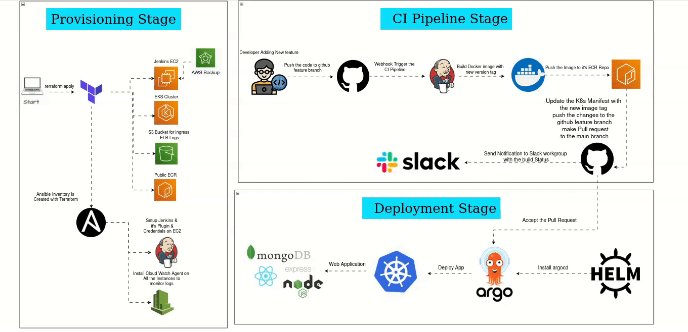
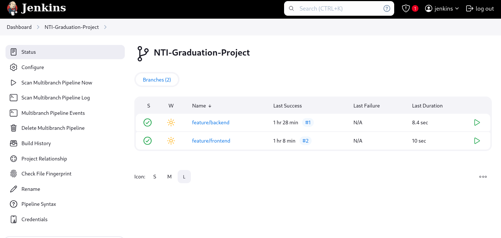
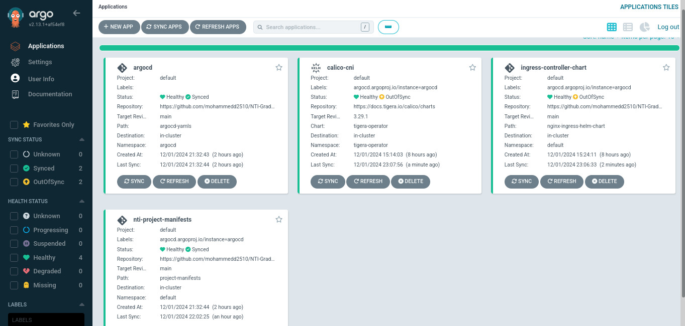
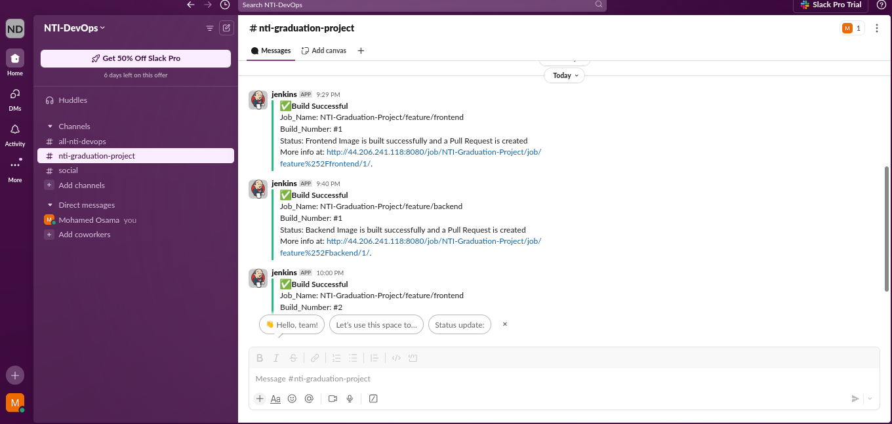

# 🚀 NTI Graduation Project: CI/CD Pipeline for a 3-Tier Web Application



This project demonstrates a fully automated **CI/CD pipeline** for a 3-tier web application, developed as part of the NTI DevOps Track. It incorporates best practices in infrastructure automation, continuous integration, and continuous deployment.

## 🖥️ Project Overview

- **Frontend**: ReactJS  
- **Backend**: ExpressJS  
- **Database**: MongoDB  

## 🛠️ Key Highlights

### 1. **Provisioning Stage with Terraform**
- Automated infrastructure creation:
  - Jenkins EC2 instance
  - EKS cluster with 2 worker nodes
- Integrated AWS Backup for daily snapshots of the Jenkins EC2 instance.
- Configured S3 bucket for ELB access logs.
- Set up separate ECR repositories for frontend and backend Docker images.

### 2. **Configuration Management with Ansible**
- Automated Jenkins installation, plugin configuration, and credential creation.
- Deployed CloudWatch agents for centralized logging across all instances.
- Installing Argocd with Helm and Applying argocd.yaml to deploy the application to the Kubernetes cluster

### 3. **CI Pipeline with Jenkins**
- Implemented a multibranch pipeline integrated with GitHub webhooks.
- The pipeline:
  - Builds and pushes Docker images to ECR.
  - Updates Kubernetes manifests with new image tags.
  - Pushes changes to GitHub and creates pull requests.
  - Sends Slack notifications for build status updates.

### 4. **CD with ArgoCD**
- Enabled a GitOps workflow for seamless updates to the Kubernetes cluster upon changes to the main branch.
- Configured using Helm.
- Integrated Nginx Ingress Controller for efficient access management.
- Applied Kubernetes Network Policies for enhanced application security.

## 📋 Getting Started

Follow these steps to set up and run the project:

### Prerequisites
Ensure you have the following installed on your local machine:
- **Terraform**: v1.5+
- **Ansible**: v2.12+
- **kubectl**: v1.25+
- **Helm**: v3.9+
- **AWS CLI**: v2+
- **Git**

### Installation Steps

1. **Clone the Repository**:  
   Clone this repository and navigate to the project directory:
   ```bash
   git clone -b IAC https://github.com/mohammedd2510/NTI-Graduation-Project.git
   cd NTI-Graduation-Project
2. **Set Up AWS Credentials**  
   Configure AWS CLI with your AWS account credentials:  
   ```bash
   aws configure   

3. **Provision Infrastructure with Terraform**  
Navigate to the `Terraform` directory, replace the backend S3 bucket name in `Provider_init.tf` with your own, initialize Terraform, and apply the configuration:
    ```bash
    cd ./IAC/Terraform
    # Replace the backend S3 bucket in Provider_init.tf
    terraform init
    terraform apply

4. **Configure Infrastructure with Ansible**  
   Use Ansible to automate the configuration of various components in your infrastructure. This includes:  

   - **CloudWatch Agent Installation**: Deploy CloudWatch agents to all EC2 instances for centralized log management.  
   - **Jenkins Server Installation**: Set up Jenkins on its dedicated EC2 instance, create the Jenkins admin account, install required plugins, and configure Jenkins credentials.  
     - Update the `vars/main.yml` file in the `Jenkins_Server_Installation` role with your Jenkins credentials, as the Jenkins credential configuration has been automated using Ansible.  
   - **Docker Installation**: Install Docker on the Jenkins EC2 instance to enable containerized builds.  
   - **ArgoCD Installation and Deployment**: Set up ArgoCD and execute the deployment script from the local machine.  

   After updating the necessary variables in the Ansible roles, execute the playbook:  

   ```bash
   # Update vars/main.yml in the Jenkins_Server_Installation role with your Jenkins credentials
   cd ./IAC/Ansible
   ansible-playbook roles_playbook.yml

5. **Set Up Jenkins Server**  
   After the Jenkins server is installed and configured using Ansible, perform the following steps manually to finalize the setup:  

   - **Access Jenkins**: Open the Jenkins server in your web browser. Use the public IP of the Jenkins EC2 instance:  
     ```
     http://<Jenkins-EC2-Public-IP>:8080
     ```  

   - **Configure Slack Plugin**:  
     - Go to **Manage Jenkins** > **Manage Plugins**, and ensure the Slack Notification Plugin is installed.  
     - Navigate to **Manage Jenkins** > **Configure System** and add your Slack workspace details to enable notifications.  

   - **Configure Git Plugin**:  
     - Ensure the Git Plugin is installed from **Manage Plugins**.  
     - Set up global Git configuration under **Manage Jenkins** > **Configure System**.  

   - **Create a Multibranch Pipeline**:  
     - Navigate to **New Item** > **Multibranch Pipeline** and provide a name for your pipeline.  
     - In the **Branch Sources** section, add your GitHub repository.  
     - Use credentials to authenticate with GitHub.  
     - Configure the repository URL and set up branch discovery to include all branches or specific branches as needed.  

   - **Enable Multibranch Pipeline Webhook**:  
     - In GitHub, go to your repository settings > **Webhooks**.  
     - Add a new webhook pointing to your Jenkins server webhook URL:  
       ```
       http://<Jenkins-EC2-Public-IP>:8080/github-webhook/
       ```  
     - Choose `application/json` as the content type and select the appropriate events for triggering the webhook.  

   After completing these steps, Jenkins will be ready to build and deploy your multibranch pipeline automatically.

## 📊 Project Summary

This project demonstrates a robust **CI/CD pipeline** for a 3-tier web application, fully automated using best practices in **infrastructure as code (IAC)**, **continuous integration (CI)**, and **continuous deployment (CD)**. Through this project, I have gained hands-on experience with key DevOps tools such as **Terraform**, **Ansible**, **Jenkins**, **Docker**, **ArgoCD**, and **Slack**, enabling me to streamline application deployment, infrastructure management, and monitoring. The solution integrates multiple tools to ensure smooth development workflows, from infrastructure provisioning to automated deployment, all while maintaining security and scalability.

## 🖼️ Project Screenshots and Diagrams

### 1. **Multibranch Pipeline in Jenkins - Build Success**
  
This image shows the multibranch pipeline in Jenkins successfully building the application, indicating the integration with GitHub and automated build process.

### 2. **ArgoCD Apps in Dashboard - Working Deployment**
  
The ArgoCD dashboard displaying the status of the applications, showing successful deployments to the Kubernetes cluster.

### 3. **Slack Notification - Build Success**
  
This screenshot shows the Slack notification that is automatically sent when a build is successful, providing real-time updates.

### 4. **3-Tier Web Application - Working via Ingress Controller**
  
The live 3-tier web application accessible through the load balancer URL managed by the Nginx Ingress Controller, demonstrating the successful deployment and accessibility.


## 🎯 Conclusion

This project serves as a comprehensive DevOps solution, automating the full application lifecycle—from code commit to deployment. By utilizing **Terraform** for provisioning, **Ansible** for configuration management, **Jenkins** for continuous integration, and **ArgoCD** for continuous deployment, this pipeline ensures efficient and reliable deployment processes. With added monitoring and security measures, it’s a production-ready solution that can scale with growing application demands.


